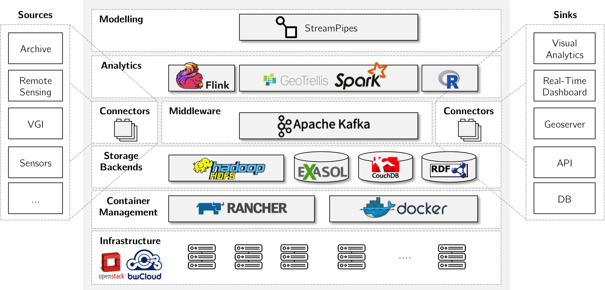

# Overview

!!! note
    Related repository is https://github.com/biggis-project/biggis-infrastructure

The BigGIS architecture, as depicted in the picture above, consists of several layers that are briefly discussed in the following.

## Modelling
[StreamPipes](StreamPipes)
tbd.

## Analytics
Analytics and processing

- [Apache Flink](https://flink.apache.org/)
- [Apache Spark](https://spark.apache.org/) featuring [GeoTrellis](https://geotrellis.io/)
- Other Languages and Notebooks: R, Java, ...
tbd.

## Middleware & Connectors
Data and control flow, connectors are nodes in StreamPipes that enable the user to load various data sources in Apache Kafka or to  
tbd.

## Storage Backends
Internally, BigGIS uses a variety of different storage backends for designated purposes.

- [HDFS](http://hadoop.apache.org/) for GeoTrellis catalog
- [Exasol](https://www.exasol.com/de/) for xx
- [CouchDB](http://couchdb.apache.org/) for StreamPipes user and pipeline configurations
- [Sesame](http://rdf4j.org/) for semantic framework of StreamPipes
tbd.

## Container Management
Running these containers in a distributed manner requires a wide variety of technologies, that must be integrated and managed throughout their lifecycle. To easily deploy our containers, our infrastructure is designed to run on [Rancher](http://rancher.com/) as our container management platform. 
Rancher enables organizations to run and manage Docker
and Kubernetes in production, providing four major components, that are:

1. Infrastructure Orchestration
2. Container Orchestration and Scheduling
3. Application Catalog
4. Authentication

That way, it is fairly easy to set up a distributed Rancher cluster in a couple of minutes (see the official [documentation](http://rancher.com/docs/rancher/v1.6/en/) 
for more information). 

## Infrastructure
BigGIS infrastructure leverages [bwCloud](https://www.bw-cloud.org/) Infrastructure-as-a-Service (IaaS) offer powered by Openstack. See the section [bwCloud](Platform_bwCloud/index.md) for additional information about the infrastructure setup.

