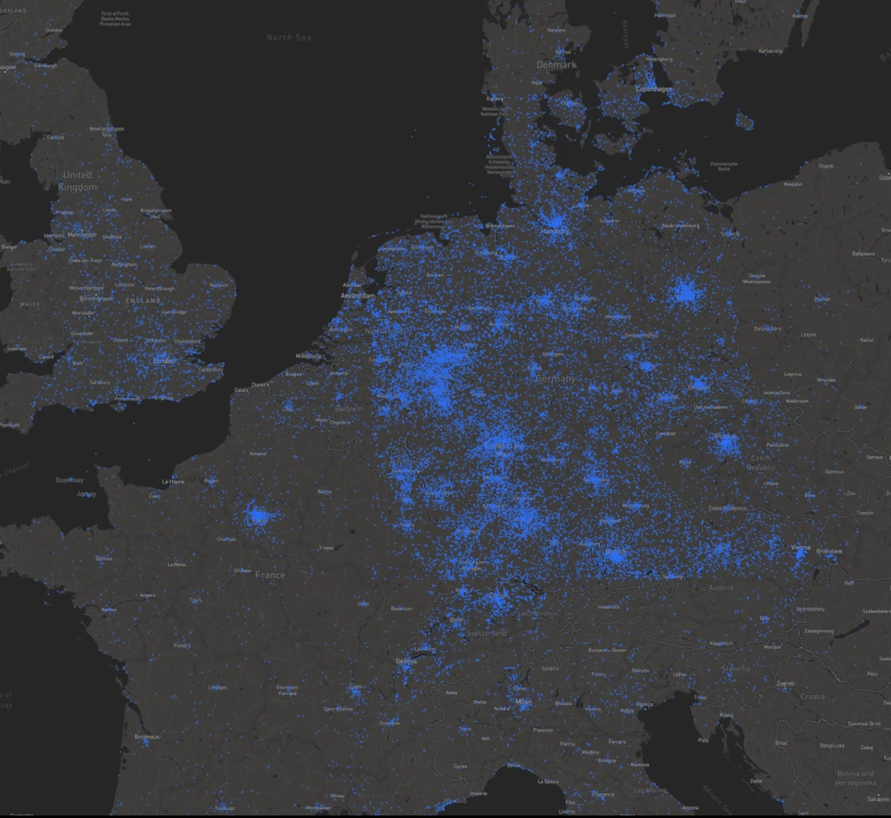
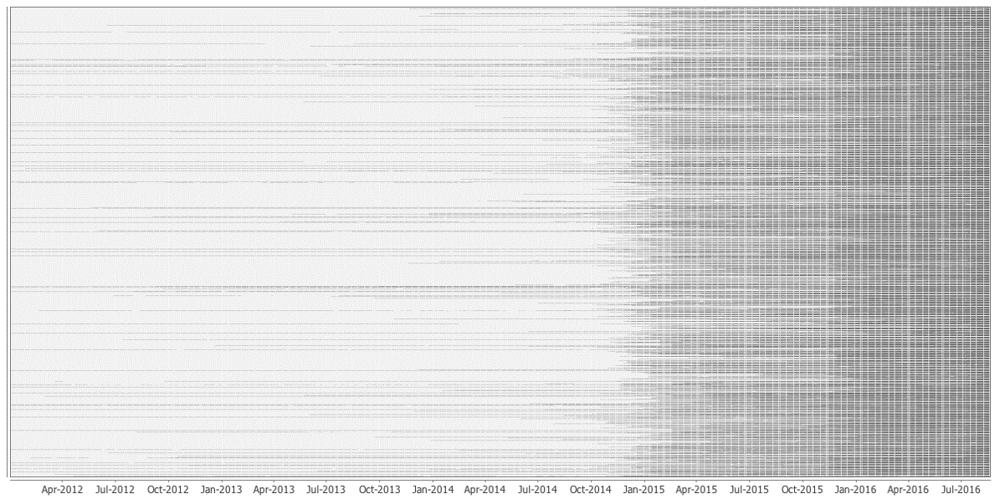

# Wunderground Dataset

To create models that support the visual analysis of the urban heat island effect, it is crucial to select suitable data
sets that can be analyzed and transformed into useful visualizations. Data always must be preprocessed to clean and
transform the data to improve the quality to avoid misinterpretations of the consecutive visualizations and to enable
users to draw valid and helpful conclusions. Therefore, data processing functions as central part of any analysis system
of underlying complex data. During this process, we follow the chronological order of the well known KDD pipeline.

## Data Description 

We use temperature data from the private Weather Underground Station Network (WUSN) that has a better spatial
distribution of stations than station networks from public authorities like the German Weather Service (DWD). The WUSN
is a crowd-sourcing platform that provides meteorological data from its participating users to gather high-resolution
data. Unfortunately, the WUSN dataset often contains invalid values that must be handled by cleaning, regression or
deletion with KNIME. To create a feature vector that contains multiple different data that are part of the complex
variable composition we found the meteorological variables that are provided by the GWS (DWD) to be useful. The DWD data
underlies certain quality standards and is more reliable than the data from WUSN, which also provides meteorological
records. Weather cannot be simply be in uenced by human compared to surface characteristics.

## Weather Underground Station Network

In Germany, the WUSN consists of 25298 stations (see Figure 1 and Figure 2) (1832 stations within city borders) that
provide multivariate data with a high temporal resolution of up to 2-3 measurements per hour (see Table 1 and Figure 3
for more details). In the preprocessing step, we replaced missing and invalid (out of possible range) values for every
station by using the average value of the previous and next recording to keep valuable information. We filtered all
other meteorological attributes that are provided since temperature is sufficient to decide whether the location of a
station is warmer than the surrounding. We decide to average the available temperature data hourly which results in a
dataset containing about 13,6 million data rows for the year of 2016. Unfortunately, some stations have values missing
for the range of multiple months, which doesn't affect the visualizations but are important when exploring the
visualization and interpreting the results.

!!! info "Figure 1: Distribution of weather stations in and around Germany."
    

!!! info "Figure 2: Distribution of weather stations in and around Germany displaed as voronoi diagram."
    

!!! info "Figure 3: Each weather station is represented by a single row."
    It can clearly be seen that the total amount of weather stations is strongly increasing from the beginning of 2015.
    

!!! info "Table 1: Description of the data provided from the wunderground network stations."
    Variable          | Description
    ------------------|-------------
    UHI Index         | Serves as indicator whether this station is a hotspot (local UHI) at this location and point in time
    Station ID        | Unique WU Station Identifier
    Location          | Geographic position of the station consisting of longitude and latitude
    Time              | Timestamp of the recording with minute-by-minute precision
    Temperature       | Provided in Celsius values with an accuracy of one decimal place
    Surrounding Temp. | Bilinear interpolated temperature of WU neighbor stations using the distance to the central station as weighting factor
    Neighbor Stations | List containing Station IDs up to 10 nearby stations

For the identification of local urban heat islands (hotspots), we considered the temporal and spatial attributes of the
WU stations. First, for every station that lies inside of the city borders, the closest (up to 10 stations) neighbor
stations where identified. Then, a temperature value for the respective surrounding of each city WU station was
calculated using a bilinear strategy considering the distance as weighting factor for the temperature value.
