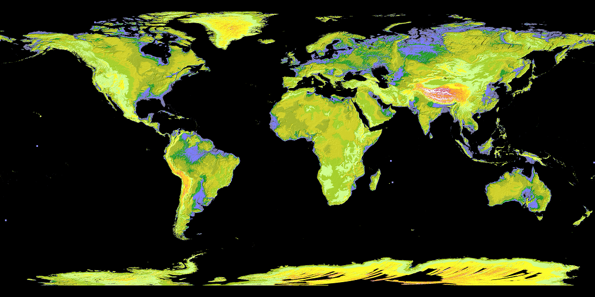

# NASA Elevation Profile

Information taken from https://asterweb.jpl.nasa.gov/gdem.asp:

The Ministry of Economy, Trade, and Industry (METI) of Japan and the United States National Aeronautics and Space
Administration (NASA) jointly announced the release of the Advanced Spaceborne Thermal Emission and Reflection
Radiometer (ASTER) Global Digital Elevation Model Version 2 (GDEM V2) on October 17, 2011.

The first version of the ASTER GDEM, released in June 2009, was generated using stereo-pair images collected by the
ASTER instrument onboard Terra. ASTER GDEM coverage spans from 83 degrees north latitude to 83 degrees south,
encompassing 99 percent of Earth's landmass.

The improved GDEM V2 adds 260,000 additional stereo-pairs, improving coverage and reducing the occurrence of artifacts.
The refined production algorithm provides improved spatial resolution, increased horizontal and vertical accuracy, and
superior water body coverage and detection. The ASTER GDEM V2 maintains the GeoTIFF format and the same gridding and
tile structure as V1, with 30-meter postings and 1 x 1 degree tiles.

Version 2 shows significant improvements over the previous release. However, users are advised that the data contains
anomalies and artifacts that will impede effectiveness for use in certain applications. The data are provided "as is,"
and neither NASA nor METI/Japan Space Systems (J-spacesystems) will be responsible for any damages resulting from use of
the data.

As a contribution from METI and NASA to the Global Earth Observation System of Systems (GEOSS), ASTER GDEM V2 data are
available free of charge to users worldwide from the Land Processes Distributed Active Archive Center (LP DAAC) and
J-spacesystems.

Below is an example image derived from ASTER GDEM V1 globe map data sets. The full data set can be downloaded from the
links above.

!!! info "Figure 1: Example image derived from ASTER GDEM V1 globe map showing the global elevation profile."
    
