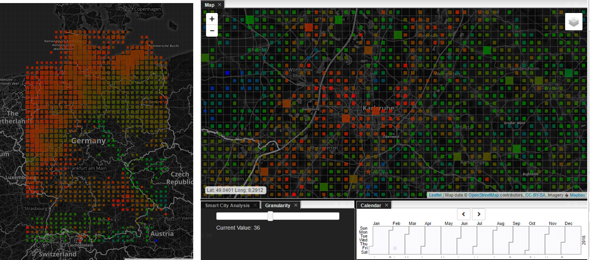

# MODIS Dataset

## Overview

The Land Surface Temperature (LST) and Emissivity daily data are retrieved at 1km pixels by the generalized
split-window algorithm and at 6km grids by the day/night algorithm. In the split-window algorithm, emissivities
in bands 31 and 32 are estimated from land cover types, atmospheric column water vapor and lower boundary air
surface temperature are separated into tractable sub-ranges for optimal retrieval. In the day/night algorithm,
daytime and nighttime LSTs and surface emissivities are retrieved from pairs of day and night MODIS observations
in seven TIR bands. The product is comprised of LSTs, quality assessment, observation time, view angles,
and emissivities. [^1]

## Details

LST Data is available with 1km grid resolution, all others in 5km resolution, typical size of a single capture
is around 1350x2000km. MODIS provides 1-2 captures per day and location (this is due to the polar Orbit of the
two MODIS Satelites). The data is provided as either Near-Real-Time (NRT) data with a delay time of 30min-3h
or as Tile Data wich is available within 2-3 Days. The Tile Data can be accessed via a coordinate-based
Bounding-Box request, NRT Data is available via FTP. All data is stored in the HDF4 file format which contains
a two dimensional array of data points containing the value, coordinates (lat, lon), record time and Quality
index (used for masking cloud covered areas)

LST Data is available since 2002 in full capability and since 1999 with reduced frequency (single satellite operation
until 2002). For the BigGIS Project, we from the University of Konstanz, made this data available to all project
partners. For this we created a crawler to collect the published Tile Data, preprocessed the published HDF4 data
and made the MODIS data available in our database since 2016.

> **Figure 1:**
> Example distribution of available MODIS LST data in Germany.

[^1]: https://modis.gsfc.nasa.gov/data/dataprod/mod11.php "Last Accessed on 26.01.2018."
