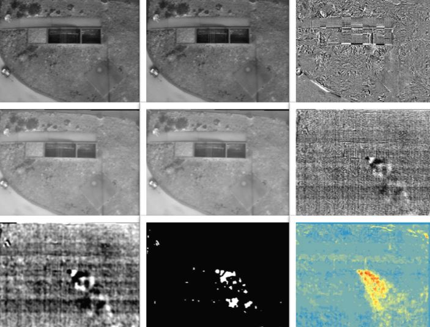
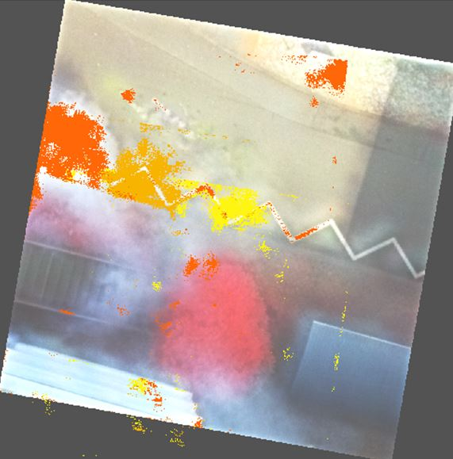
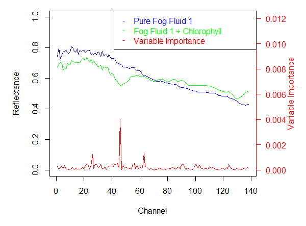
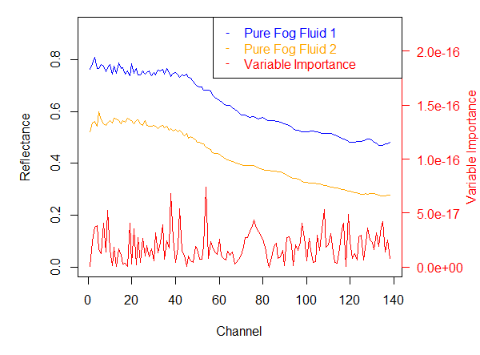

# Optical Remote Sensing

The starting point for the BOS scenario in the BigGIS frame is the satellite-based emergency management services of
Copernicus or the charter “Space and major Disasters”. The idea was to implement similar sensors on an unmanned aerial
vehicle (UAV) platform and bring it to smaller incidents like larger fires or CBRN. Therefore, thermal (IR) and
hyperspectral cameras was used as well as RGB cameras to do some testing in simulated situations:

  -	Detection and following smoke clouds in imageries
  -	Detection of “non visible” gas clouds
  -	Identification of “chemicals”

## Gas Cloud Detection

To perform the simulations several test scenarios were prepared in two campaigns in Karlsruhe and Dortmund. The smoke of
Heptane (UN 1206/Kemmler 33) was recorded as well as a mixture from gasoline (1203/33) and diesel (1202/30). A gas
leakage was simulated at the Dortmund Fire Brigade Education Center using Methane ($CH_4$; 1971/23). And a gas cloud
containing “chemicals” was simulated by a fog machine which nebulized a 50% mixture of propylene glycol
(propane-1,2-diol) and chlorophyll from the food branch.

First analysis eg. for the “invisible” Methane gas cloud show quite good results using the IR cameras. On UAVs offered
by Sitebots and AI Drones two choices of cameras were used:

  -	OPTRIS PI
  -	FLIR Vue Pro R

Both cameras give the radiometric signatures and not just “colored pictures”. The Images were spatially referenced by
standard procedures. It was found that building differences just show intereferences in the pictures (shown in the first
row of Picture 1). Good results were given by a Halcon referencing based on sub pixel accuracy (row two in Picture 1).
Using difference analysis on about 25 pictures show a clear signature of the exhaling methane (row three in Picture 1).

!!! info "Picture 1: Gas cloud detection using thermal imageries"
    
 
## Spectral Analysis of Gas Clouds

The idea of remotely detecting and identifying chemicals using a hyperspectral sensor is not new.
The so called Analytical Task Force (ATF[^ATF]) is using the Van-based RAMAN spectroscope SIGIS 2 to
detect and identify chemicals in CBRN incidents.

[^ATF]: https://www.bbk.bund.de/DE/AufgabenundAusstattung/CBRNSchutz/TaskForce/ATF_einstieg1.html

The BigGIS project intended to be more flexible than a SIGIS 2 mounted in a car. Therefore, as a proof-of-concept the
implementation of a system allowing for spectral analysis of gas and aerosol clouds mounted on a UAV was subject of
study on the level of a proof-of-concept. Due to the fact that multispectral IR-sensors as they are utilized in the
SIGIS 2 system require relatively heavy-weight cooling units disqualify these systems for the usage with a UAV.
Therefore, within the project a multispectral sensor sensitive in the spectral range of visible light and near IR (450 -
950 nm) was utilized for spectral analyzation. The sensor Cubert 185 UHD Firefly[^FIREFLY] has a weight of about 500 g
and could easily be mounted on a UAV.

[^FIREFLY]: http://cubert-gmbh.com/uhd-185-firefly/

Using this sensor “smoke clouds” from a mixture of “Disco fog” and chlorophyll (see below) were recorded. Each pixel in
the image contains the spectral information of the reflected light spread over 125 bands ranging from a minimum
wavelength of 450nm to a maximum of 950nm.

### Triangular Chlorophyll Index

In a first Analysis the propagating chlorophyll cloud was identified in the recorded image via the calculation of the
[Triangular Chlorophyll Index (TCI)](../../methods/spectral_analysis_tci.md ) for each pixel in the spatially referenced
image.

The result is shown in the picture below:
Row one in Picture 2 is showing the chlorophyll cloud propagating from west
to east through spatially referenced pseudo color pictures. Interesting
is the underground partly paved and partly consisted of a grass strip.
In the right picture the cloud covers a small
tree.

The TCI algorithm was applied on the three pictures in the middle row.
Using a reference aerial photograph and building the difference to such
an image (third row) one can find chlorophyll only detected on the
asphalt, not on the green strip or the tree due to the fact that the
method cannot distinguish chlorophyll from the plants from
chlorophyll of the cloud.

!!! info "TODO: Chemical cloud detection"
    
    Wie ist die obige Erklärung zu verstehen? Geht es hier darum die Bereiche mit zeitlich konstant hohem TCI-Wert (=
    nicht die Chlorophyll-Wolke) auszuschließen?

Picture 3 now shows the composition of the referenced and analyzed
pictures with all three stages of the moving chlorophyll cloud. One now can
see the grass strip and the tree in addition to the gas cloud over the
asphalt.

!!! info "Picture 3: TODO: Eingefärbte Elemente detailierter erklären."
    

### Logistic Regression Classification of Cloud Reflectance

A second experiment set was dedicated to a more general evaluation of cloud constituents. Here, the identification of
constituents via logistic regression classification bases on the whole spectral range of the Cubert 185 UHD Firefly, in
contrary to the previous example where the identification based on only three wavelengths.

As a proof of concept, multispectral images of clouds produced by a fog generator fueled with two different fog fluids
and solutions of each fog fluid mixed with defined proportions of chlorophyll (TODO: fog fluids genauer spezifizieren
und chlorophyll-lösung) were recorded.

In the experimental setup the Cubert 185 UHD Firefly was positioned facing a white wall in 1.2 m distance as constant
background. The fog generator was placed between camera and wall in such a way, that the ejected cloud passed the camera
in roughly 0.6 m distance while filling the whole recorded image plane. Immediately before each measurement set the
incident intensity (white-balance intensity) in front of the camera was recorded by capturing the reflectance of a
spectralon coated sheet at a distance of 0.6 m. By dividing the recorded reflected cloud intensities by the
white-balance intensity the cloud reflectance was determined.

 <!-- evtl. hier noch untersuchte Lösungskonzentrationen aufführen (nur in Paperversion) -->

The reflectance spectra of evaporated mixtures of fog fluid with chlorophyll not in all cases show the typical
chlorophyll absorption minimum. Consequently, chlorophyll is not uniformly evaporated with the given setup but ejected
in irregular chlorophyll bursts instead. Therefore, a TCI pre-evaluation was carried through on each pixel of all
recordings of clouds of evaporated chlorophyll mixtures, in order to label positive chlorophyll spectra as training and
test data for the logistic regression. After spectra inspection of several samples a threshold of $TCI = 0.05$ was
chosen above which the spectra was labeled chlorophyll-containing. Spectra of evaporated chlorophyll mixtures with
$TCI < 0.05$ were not regarded in the further analysis. The spectra of clouds of evaporated pure fog fluids provided the
negative chlorophyll data. The table below shows the count of spectra for the different cloud categories that was used
for training for the logistic regression classifiers in the next subsections.

|                | Fog Fluid 1  | Fog Fluid 2 |
|: ------------  |:------------:|:-----------:|
| No Chlorophyll |         5000 |        7500 |
| Chlorophyll    |         3926 |       68541 |

The test data set comprised the following sample sizes:

|                | Fog Fluid 1  | Fog Fluid 2 |
|: ------------  |:------------:|:-----------:|
| No Chlorophyll |         2500 |        2500 |
| Chlorophyll    |         2500 |        2463 |

Based on this data different logistic regression classifiers were trained.

#### Chlorophyll vs. Non-Chlorophyll

!!! info "Figure TODO: Pure Fog vs Chlorophyl"
    

First a logistic regression classifier was trained to distinguish between spectra of clouds containing chlorophyll and
pure fog fluid, irrespective of the type of the fog fluid. The figure above displays typical spectra for a cloud aof
pure fog fluid and a cloud containing chlorophyll. In the latter case, the reflectance minimum due to the absorption
maximum of chlorophyll can clearly be seen in the curve around channel 45. This also is the region where the variable
importance (i.e. value of the t–statistic for each model parameter (= channel)) peaks and marks the most significant
channels of the classifier.

The training accuracy was found to be
$$
Acc_{train} = \frac{true Positives + true Negatives}{Positives + Negatives} = 1.
$$

The out-of-sample test also showed very reliable results:

Test samples with fog fluid 1:

|                   | Classified No-Chloro.  | Classified Chloro. |
|: ---------------- |:----------------------:|:------------------:|
| Sample No-Chloro. |                   2500 |                  0 |
| Sample Chloro.    |                      0 |               2500 |

$$
Acc_{test} = 1
$$

$$
Precision_{test} = 1
Recall_{test} = 1
F1_{test} = 1
$$

Test samples with fog fluid 2:

|                   | Classified No-Chloro.  | Classified Chloro.
|: -----------------|:----------------------:|:-------------------:
| Sample No-Chloro. |                   2500 |                  0
| Sample Chloro.    |                      0 |               2463

$$
Acc_{test} = 1
$$

The high accuracy bases on the very clear feature of the chlorophyll absorption dip in the spectrum.

#### Pure Fog Fluid 1 vs. Fog Fluid 2

While the spectra of chlorophyll containing clouds show a clear distinction feature against the non-chlorophyll
containing spectra, the reflectance spectra of the two pure fog fluids show a similar relative pattern, while the
absolute reflectance level of the fog fluid 1 seems to be elevated compared to fog fluid 2 (see figure above).
Therefore, a logistic regression classifier was trained for the distinction of clouds of the two pure fog fluids. The
training accuracy for this classifier was found to be:
$$
Acc_{train} = 1
$$

Out-of-sample performance:

|                    | Classified Fog Fluid 1  | Classified Fog Fluid 2 |
|: ------------------|:-----------------------:|:----------------------:|
| Sample Fog Fluid 1 |                    2452 |                     48 |
| Sample Fog Fluid 2 |                       1 |                   2499 |

$$
Acc_{test} = 0.99
$$

$$
F1_{test} = 0.99
$$

Despite the lack of prominent characteristic features in the reflectance spectra the accuracy and the F1 score of the
classifier is yet rather high. That changes when the classifier is tested on reflectance data of mixtures of the
different fog fluids with chlorophyll, as shown in the table below:

|                | Classified Fog Fluid 1  | Classified Fog Fluid 2 |
|: ------------  |:------------:|:-----------:|
| Sample Fog Fluid 1 |         0 |        2500 |
| Sample Fog Fluid 2 |         0 |       2463 |

$$
Acc_{test} = 0.49
$$

$$
F1_{test} = 0.66
$$

Obviously this classifier is not robust against the mixture of features of another substance in the cloud.

#### Fog Fluid 1 vs. Fog Fluid 2 (with and without Chlorophyll)

To overcome the weakness of the previous classifier another classifier for the distinction between different fog fluids
was trained including the reflectance spectra of mixtures with chlorophyll. Here, the training accuracy was found to be:
$$
Acc_{train} = 1
$$

The out of sample performance for clouds of pure fog fluids is shown in the table below:

|                | Classified Fog Fluid 1  | Classified Fog Fluid 2 |
|: ------------  |:------------:|:-----------:|
| Sample Fog Fluid 1 |         2500 |        0 |
| Sample Fog Fluid 2 |         0 |       2500 |

$$
Acc_{test} = 1
$$

$$
F1_{test} = 1
$$

Interestingly, the performance on the test data of pure fog fluids is even slightly better when trained with data
samples including mixtures with chlorophyll. This might be explained with overfitting in the case of training only with
data of pure fog fluids (TODO diskutieren).

The out-of-sample performance for mixtures of the different fog fluids with chlorophyll is shown in the table below:

|                | Classified Fog Fluid 1  | Classified Fog Fluid 2 |
|: ------------  |:------------:|:-----------:|
| Sample Fog Fluid 1 |         2014 |        486 |
| Sample Fog Fluid 2 |         11 |       2452 |

$$
Acc_{test} = 0.90
$$

$$
F1_{test} = 0.90
$$

The performance is rather convincing even though the spectra of the fog fluids are overlayed with the
characteristic chlorophyll spectrum.

#### Conclusion

It was shown that logistic regression can be used to identify constituents of clouds on basis of the reflectance spectra
in the range of visible light with the here presented system, especially when strong characteristic features are present
as in the case of chlorophyll. Besides that, even the identification of constituents with weaker characteristic features
can be carried through as in the case for the distinction between the two fog fluids. For the latter case, the above
findings suggest that the classifier for the constituent of interest should be carried through with data also regarding
a variety of probable accompanying cloud constituents. Otherwise, the overlay of the different spectra might diminish
the classifiers performance.
