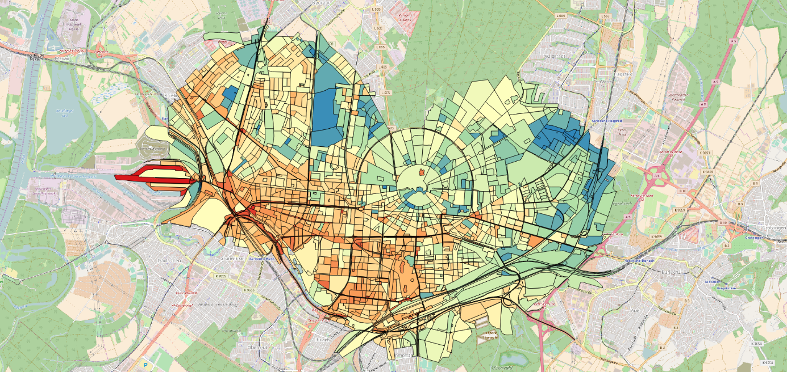

# Optimal Sensor Placement

Semistationary sensors such as the SenseBox (https://sensebox.de/en/) offer an excellent possibility for gaining
detailed insights into the urban climate. Connected to WiFI or LAN, they continuously provide measurements, e.g.
concerning the temperature, humidity, noise or brightness. However, these measurements are local in nature, meaning
that in order to gain detailed and reliable information about an entire city, several sensors have to be distributed
within the region of interest. In this case, the placement of sensors becomes essential.  We therefore propose an
approach for proposing optimal sensing locations, taking into account their relative distance, covered land use classes
and temperatures.

!!! info "Figure 1: Land use classes in Karlsruhe"
    

##Features
 Our model incorporates several features:
-	Sensors are placed such that they are within a maximum range to a number of base stations of a LoRaWAN (Long Range
Wide Area Network), allowing to continuously transmit their measurements.
-	The set of sensors should cover all land use classes within the city.
-	The selected sensing locations should cover a wide range of temperatures.
-	The locations of any other available sensor should be taken into account in order to avoid redundant measurements.

!!! info "Figure 2: Temperatures aggregated for landuse class polygons"
    

## Solution Approach and Results
In a preprocessing step, the centers of the polygons describing individual land use classes are selected as candidate
sensing locations, making it possible to formulate a discrete planning problem. The range of the LoRaWAN restricts
possible locations, thus ensuring connectivity.
We can then model the planning problem as a p-center problem. Generally speaking, this formulation seeks to minimize
the maximum distance between locations of interest as described above and the next sensing locations.  The approach
yields both optimal sensing locations as well as alternative candidates in case the initially chosen locations is
unavailable. As shown in Figure 3, locations are distributed well across the city, covering as large an area as
possible.

!!! info "Figure 3: Proposed sensing locations and alternative positions"
    