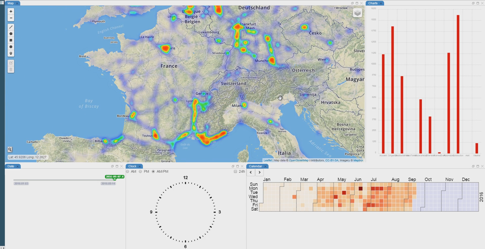

# Traffic Incidents

## Motivation

The visual analysis of traffic incidents is of high interest in the BOS-scenario. The real time gathering of traffic
data and effective ways of visualizing aim to support emergency services in reacting to incidents or when searching for
hot spots. Furthermore, the analysis of traffic and mobility data is of high interest for urban planning as it, for
example, allows the planning of future infrastructure.

## Visual Analysis of Traffic Incidents 

Our visual analysis allows to gain overview as well as detailed representations of the underlaying data. At first
glance, a calendar visualization of traffic incidents (Figure 1) allows to get an impression about the temporal
distribution of the incidents. Figure 1, for example, allows the user to easily detect a repeating pattern in July 2016
where each monday for three weeks in a row was  strongly noticeable.

!!! info "Figure 1: Calendar visualization of traffic incidents."
    

Additionally, we enable domain experts to inspect the categorical distribution of gathered traffic incidents. Domain
experts can interactively decide for timespans of interest (e.g., only taking incidents into account which occur at
night (Figure 2) or at afternoon (Figure 3)).

!!! info "Figure 2: Categorical distribution of gathered traffic incidents occuring at night."
    

!!! info "Figure 3: Categorical distribution of gathered traffic incidents occuring at afternoon."
    

Ultimately, it is of high importance to provide adequate spatial visaulizations in order to allow domain experts to
explore the data. We provide a more detailed animated heat map visualization on the map (see the video) as well as more
abstract graph representation. The graph has been developed in order to detect patterns at larger scale. The graph is
built hierarchically. On the top level, a spatial clustering is used to detect areas of interest. Afterwards, we split
the clusters in the graph visualization based on their incident type by using color. On the next level, we indicate the
severity by using saturation.

!!! info "Figure 4: Several kinds of visual overviews to effectively aggregate the available data."
    

## Video 

A video demonstrating some of the capabilities of the analysis of traffic incidents can be found by clicking below or
[here](http://files.dbvis.de/stein/Traffic_Incidents.mp4).

