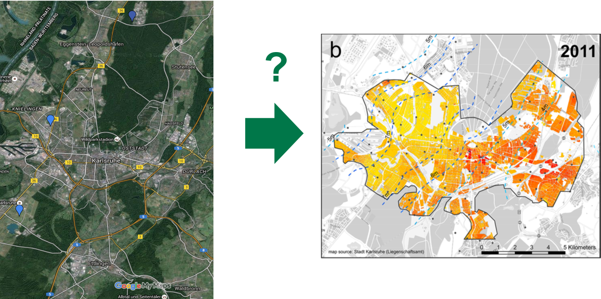
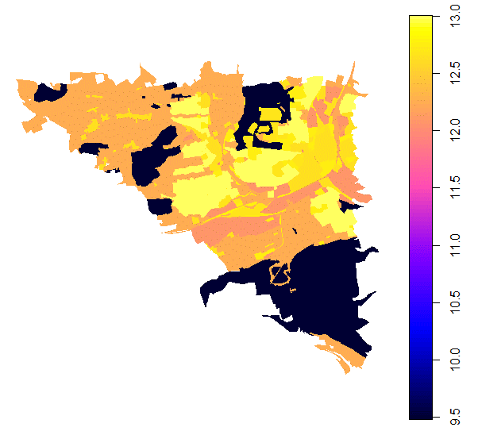
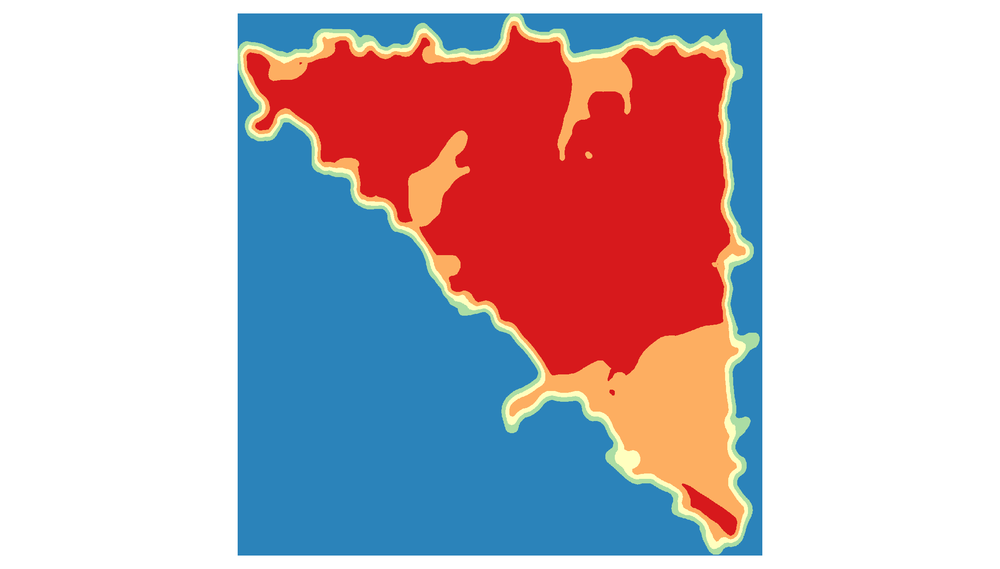

!!! note "Responsible person for this section"
    Julian Bruns

# Urban Heat Islands

The Urban Heat Islands (UHI) effect describes the systematic differences between cities and the surrounding areas. It was termed in [Oke, T. R. (1982)] [^Oke, T. R.], but is the topic of studies in the 19th century. In the BigGIS Project it was the use case of the smart city scenario. While it is regularly observed that huge temperature differences exist not only between cities and rural areas but also
between nearby locations within urbanizations, research focussed on the first phenomenon, referred to as urban heat islands (UHI). The second phenomenon of intra-urban head islands (IUHI) received scant attention so far. While underlying causal reasons for IUHI, such as different land use, albedo, or NDVI are generally known, no model exists that makes use of these data sources and their interaction to predict intra-urban temperature differences and their developments, e.g., between different neighborhoods or explains the reasons behind this.

The overall goal is to produce an fine-grained overview of the temperature of a city for smarter planning (as shown in the figure below).

!!! info "Fine-grained overview of the temperature of a city for smarter planning."
    

During the project, several advances in the area of analysis and data availability were achieved.

1)	In Cooperation with the University of Münster as well as the LUBW several new weather stations are placed in the city of Karlsruhe. These are of the type sensebox (https://sensebox.de) and official stations. The data is openly available at the LUBW and the opensensemap. The placement is based on the uncertainty of the existing predictions and location optimization algorithms.

2)	New methods to predict temperature data were researched. These are currently under review (example for the city of Aalen in figure below).

!!! info "Example for temperature prediction: predicted temperature distribution in the city of Aalen."
    

3)	A more stable analysis and detection of hot spots based on the getis-ord statistic were developed and published; see Hot Spot Analysis
Example for Aalen:

!!! info "Example: hot spot analysis for the city of Aalen."
    

4)	The first quantifiable metric to detect the stability of found hot spots was developed, see [Stability of Hotspots](../../methods/soh.md).

5)	Existing VGI weather stations such as from the Wunderground project were used and their quality was automatically assessed, see [Bruns et al. (2018)] [^Bruns et al. (2018)].

6)	New Big Data parallel predictions of temperature based on VGI and Kriging methods were developed and tested based on the work in [Bruns et al. (2018)] [^Bruns et al. (2018)].

!!! TODO

    - add links to related github repos
    - add links to related papers
    - describe APIs especially from the end-users' point of view

- Temperaturinseln in Karlsruhe und anderen Städten
- Temperaturdaten: Volunteered geographic data (z.B. wunderground.com)
- Korrelation zwischen Bereichen in verschiedenen Städten mit ähnlichem Temperaturverlauf --> Zugang zu Ursachen für Temperaturentwicklung

- Vorstellung der Heat-Islands-Analyse
- Wetterstationen
- Technik: Sensebox (<https://sensebox.de>)
- Beispielstation (<https://opensensemap.org/explore/58b4354fe53e0b001251119d>)
- Hotspotanalyse (SoH, Stability of Hotspots):
- Abhängigkeit des Auftretens von Hotspots von der Aggregationsstufe
- Ausblick:
- Sensorfusion in Kooperation mit SDIL (smart data innovation lab)

## Related Scenarios

  - [Smart City](../scenarios/smartcity)

[^Oke, T. R.]: Oke, T. R. (1982). The energetic basis of the urban heat island. Quarterly Journal of the Royal Meteorological Society 108(455), 1–24.)

[^Bruns et al. (2018)]: Bruns, J., J. Riesterer, B. Wang, T. Riedel, and M. Beigl (2018). Automated quality assessment of (citizen) weather stations. Journal GI_Forum 2018 (Accepted)