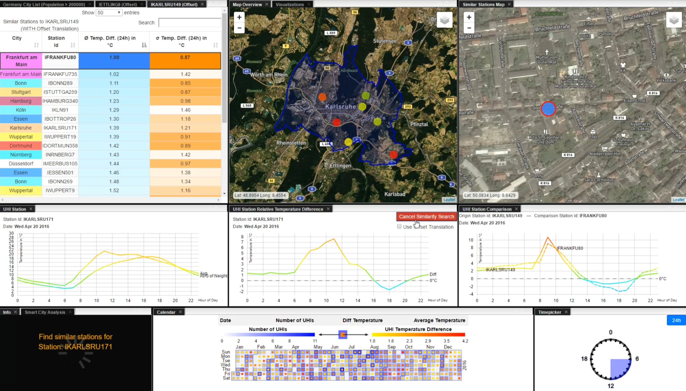
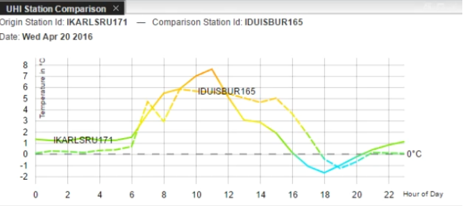

# Visual Analysis of Spatio-Temporal Event Predictions

The well-known phenomenon of the Urban Heat Island effect in city areas is an important issue as a result from the ongoing urbanization and industrialization process. Analyzing the causes for increased temperatures in urban areas is a complex task that depends on several variables like energy management, surface characteristics, weather, vegetation index, population, industrial territory, transportation, air pollution and others. City and country planners are in need for new technology that supports them during decision-making processes by meaningful visualization and data analysis techniques to improve urban climate and the efficiency of energy management. We propose a visual analytics approach to enable domain experts to visually explore current temperature conditions of city areas and interactive steering techniques on characteristic features to discover the influence of available variables on the outcome. The presented prediction models are intended to provide insights about future conditions to elicit the effect of various variables on the intensity of urban heat islands.

## Used Data Sources
- Wunderground
- ATKIS/ALKIS
- DWD
- ...

Picture 1: WU Station distribution in and around Karlsruhe.

## Visual Analysis of Urban Heat Islands

Picture 2: Our system allows the prediction of Urban Heat Islands with Machine Learning. Furthermore, we provide an interactive system for the visual analysis of the occurences of urban heat islands. Interactive parameter steering and similarity search allows to investigate impacts of different variables. 

Picture 3: Identified urban heat islands with high similarity for a station in Karlsruhe. The identified similar weather station is positioned in Duisburg. The user is enabled to further explore the dataset by brushing and linking. 

- Prediction of Urban Heat Islands with Machine Learning
- Glyph-based visualization of land usage and UHI occurences
- Interactive visualizations allowing for brushing and filtering
- Interactive parameter steering to investigate impacts of different variables on the occurence UHIs
- ...

## Related Scenarios
- [Smart City](../scenarios/01_city.md)
