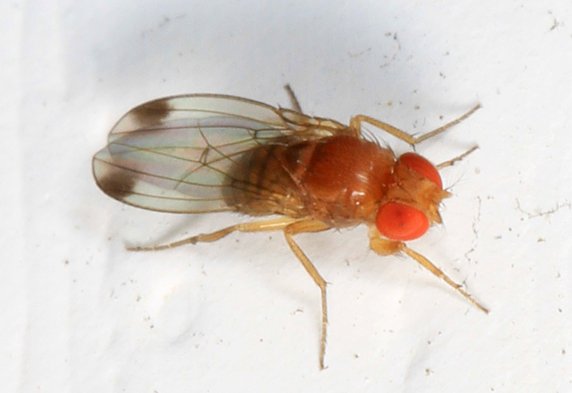
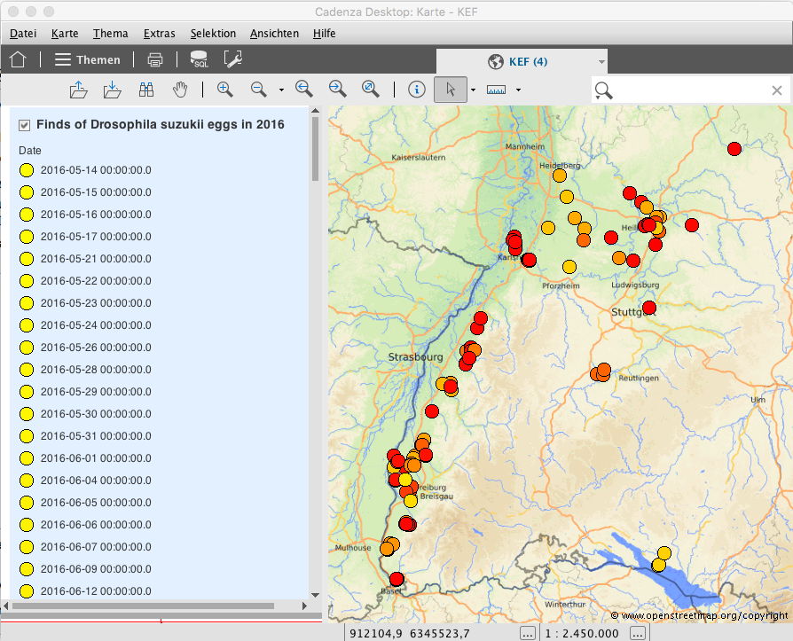

# Environment

!!! note "Responsible person for this section"
    - Hannes Müller (LUBW)
    - Andreas Abecker (Disy)
    - Johannes Kutterer (Disy)

In the globalized world invasive species are a growing concern. Certain invasive species can lead to ecological damage
and commercial losses and eventually health problem for humans and animals. The geographical nature of these phenomena
advise the analysis, evaluation and visualization with geographic information system (GIS).

!!! info "Drosophila suzukii (male)"
    
    Clearly recognizable is the dot on the wing. The spotted wing indicates that the picture
    shows an male individual. (Photo: Judy Gallagher, http://www.flickr.com/photos/52450054@N04/15675291741/,
    [Creative Commons Attribution 2.0 Generic](https://creativecommons.org/licenses/by/2.0/))

One invasive species which called attention in the last years is the Drosophila suzukii, commonly named the spotted wing
drosophila. The vinegar fly was widely observed in parts of Japan,Korea and China. From there the fly was spreaded
arround the world. In the last 10 years they could be observed in Swisserland and in South-West Germany (Rhine Vallay).
In other parts of the world e.g. the United States this spread has also been observed.

!!! info "Visualisation in Disy Cadenza"
    
    Distribution of egg finds of the Drosophila suzukii in 2016 in south west Germany

Unlike other Drosophila, it infests non-rotting and healthy fruits and is therefore of concern to fruit growers, such as
vintners. The main commercial inpact are on summer fruit including cherries, blueberries, grapes, nectarines, pears,
plums, pluots, peaches, raspberries, and strawberries. In the United States the yield loss estimates widely vary and
reached 80% loss in some areas and crops [^1].

For the control of pests it is necessary to combine and analyze different information sources in real time.The BIGGIS
project adresses this challenge by covering the following aspects:

  1. Collecting data from several sources like the current distribution of the fly, wether conditions, elavation, landuse etc.
  2. Data analysis of risk areas
  3. Interactive visualisation of risk areas and infestion likelyhood

[^1]: Mark P. Bolda; Rachael E. Goodhue & Frank G. Zalom (2009). Spotted Wing Drosophila: Potential Economic Impact of
      Newly Established Pest ([PDF](http://giannini.ucop.edu/media/are-update/files/articles/v13n3_2.pdf)).
      Giannini Foundation of Agricultural Economics, University of California.
